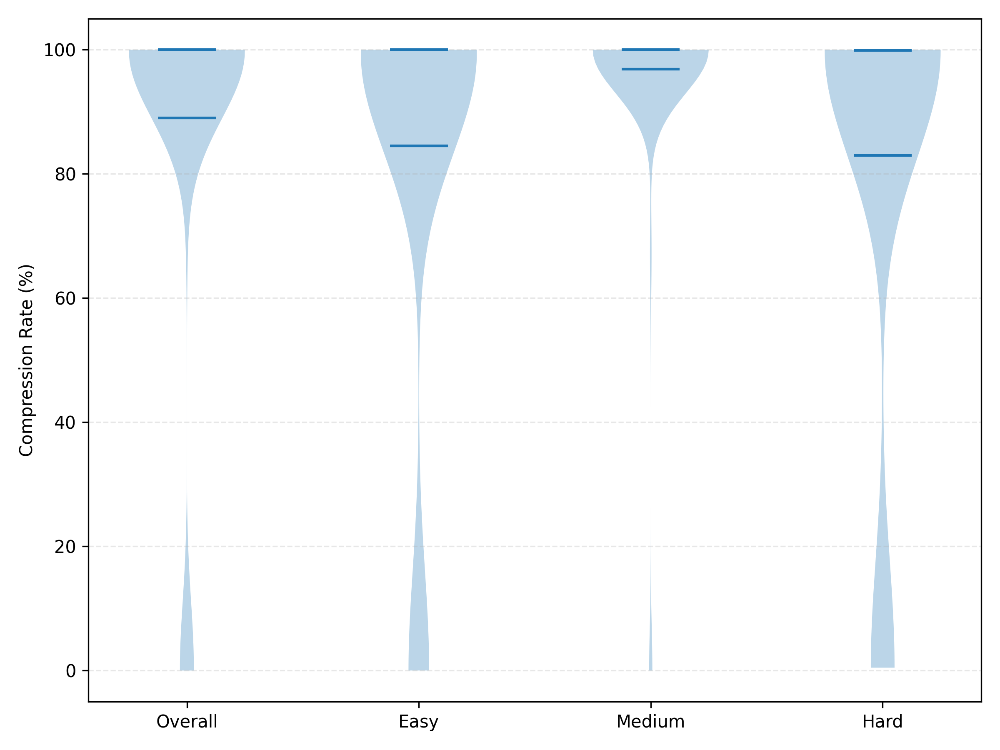

# ReduceFix

ReduceFix is an automated program repair (APR) system that leverages LLM-generated reducers to minimize failure-inducing test inputs before using them to guide repair generation. This repository contains the implementation and experimental scripts for reproducing the results presented in our paper.

> **Prompt Formats**: We have organized all prompt formats used in the paper into the `prompt_formats/` directory for easy reference. See [Prompt Formats](#prompt-formats) for details.

## Overview

ReduceFix consists of three main phases:
1. **Reducer Generation**: Prompts a code LLM once to generate a customized reducer script that can automatically reduce failure-inducing inputs for the specific task
2. **Input Reduction**: Executes the generated reducer script to shrink the failure-inducing input i₀ into a reduced test input i* while preserving the failure
3. **Patch Generation**: Embeds ⟨P, $s_w$, i*⟩ in a repair prompt, samples candidate patches, and validates each one against the entire test suite until a correct program is found

The pipeline receives five inputs: the task description P, a correct reference solution A, a buggy submission $s_w$, the hidden test suite I, and one failure-inducing input i₀.

## Prerequisites

- Python 3.8+
- Access to LLM APIs (Qwen-Plus, DeepSeek-V3, etc.) with API keys configured in `config.py`

## Quick Start

1. **Setup Configuration**:
   ```bash
   # Configure your API keys in config.py
   # Edit config.py with your actual API credentials
   ```

2. run the following scripts:

```bash
./rq1.sh
./rq2.sh
./rq3.sh
./rq4.sh
./rq5.sh
```

3. The LFTBench (including C++ and Python versions) is located in the `lftbench` sub-directory.

## Repository Structure

```bash
ReduceFix/
├── lftbench/                  # LFTBench dataset
│   ├── data/                  # Ground truth and submissions
│   │   ├── ground_truth/      # AC (Accepted) solutions
│   │   │   ├── cpp/           # C++ AC codes
│   │   │   └── python/        # Python AC codes
│   │   └── submissions/       # WA (Wrong Answer) submissions
│   │       ├── cpp/           # C++ submissions
│   │       └── python/        # Python submissions
│   ├── metadata/              # Problem metadata
│   │   ├── problems.json      # Problem descriptions, samples
│   │   ├── cpp_submissions.jsonl
│   │   └── python_submissions.jsonl
│   ├── tests/                 # Full test suites
│   │   ├── abc361/C/in/       # Test inputs for each problem
│   │   └── ...
│   └── README.md              # Dataset documentation
│
├── results/                   # Experiment artifacts
│   ├── abc361c/               # Per-problem directory
│   │   ├── reducer.py         # Generated reducer
│   │   ├── ac.cpp             # AC code
│   │   ├── 68123456_cpp/      # Per-submission artifacts
│   │   └── ...
│   └── ...
│
├── oss_fuzz_results/          # OSS-Fuzz evaluation data
│   ├── cases_data/            # Case-by-case data
│   ├── experiment_results/    # Experiment statistics
│   └── compute_*.py           # OSS-Fuzz analysis scripts
├── prompt_formats/
│   ├── repair.prompt          # Prompt format of repair on LFTBench (C++)
│   ├── repair-py.prompt       # Prompt format of repair on LFTBench-Py (Python)
│   ├── repair-ossfuzz.prompt  # Prompt format of repair on OSS-Fuzz
│   ├── repair-diffline.prompt # Prompt format of repair with Diff Lines strategy
│   ├── reducer.prompt         # Prompt format of reducer generation for LFTBench
│   ├── reducer-ossfuzz.prompt # Prompt format of reducer generation for OSS-Fuzz
├── result_reducer_*.json      # Minimized reduction results (RQ1)
├── result_repair_*.json       # Minimized repair results (RQ2, RQ3)
├── result_chatrepair.json     # ChatRepair results (RQ4)
├── result_cref.json           # CRef results (RQ4)
│
├── rq1.sh                     # RQ1: Reducer effectiveness
├── rq2.sh                     # RQ2: Repair with reduced tests
├── rq3.sh                     # RQ3: Prompt composition
├── rq4.sh                     # RQ4: ChatRepair & CRef integration
├── rq5.sh                     # RQ5: OSS-Fuzz evaluation
│
├── reducer_builder.py         # Generate problem-specific reducers
├── reducer_test.py            # Test reducers on submissions
├── retest_single.py           # Single submission testing (RQ1 demo)
│
├── evaluate_repair.py         # Repair evaluation (main)
├── evaluate_repair_main.py    # Repair evaluation (RQ3)
├── evaluate_repair_with_chatrepair.py  # ChatRepair evaluation
│
├── analyze_*.py               # Statistical analysis for each RQ
├── compare_rq1_methods.py     # RQ1 comparison table
├── summarize_*.py             # Result summarization scripts
│
├── llm.py                     # LLM API interface
├── tutor.py                   # API client configuration
├── config.py                  # API keys and configuration
├── lftbench_utils.py          # Dataset access utilities
├── tools.py                   # Utility functions
└── README.md                  # This file
```

### Key Components

- **`lftbench/`**: Self-contained benchmark dataset with problems, solutions, submissions, and test suites
- **`results/`**: Generated reducers and per-problem/per-submission artifacts
- **`rq*.sh`**: Main entry points for reproducing each research question
- **`result_*.json`**: Consolidated experimental results (minimized for portability)
- **`temp/`**: Full-version result files with detailed metadata (not for distribution)
- **Core scripts**: `reducer_builder.py`, `reducer_test.py`, `evaluate_repair*.py`
- **Analysis scripts**: `analyze_*.py`, `summarize_*.py` for statistical analysis
- **`prompt_formats/`**: Prompt templates used in the paper (see [Prompt Formats](#prompt-formats))

## Prompt Formats

The `prompt_formats/` directory contains all prompt format templates used in the paper for easy reference and reproduction:

### Repair Prompts

1. **`repair.prompt`** - Standard repair prompt for LFTBench (C++)
   - Contains: problem description, buggy code, reduced test case (input/output)
   - Used in: RQ2 as ReduceFix's main repair strategy

2. **`repair-py.prompt`** - Repair prompt for LFTBench-Py (Python)
   - Same structure as `repair.prompt`, but for Python code
   - Used in: RQ2 for cross-language validation

3. **`repair-ossfuzz.prompt`** - Repair prompt for OSS-Fuzz
   - Contains: crash info, stack trace, annotated source code, reduced test case (hex format)
   - Output format: SEARCH/REPLACE style patches
   - Used in: RQ5 for real-world project repairs

4. **`repair-diffline.prompt`** - Prompt for Diff Lines strategy
   - Shows only the first 10 lines of output differences, without full input
   - Used in: RQ3 to test the impact of information selection

### Reducer Generation Prompts

5. **`reducer.prompt`** - LFTBench reducer generation prompt
   - Input: problem description, example reducer code
   - Output: problem-specific reducer.py script
   - Used in: RQ1, RQ2, RQ3, RQ4 to generate reducers for LFTBench problems

6. **`reducer-ossfuzz.prompt`** - OSS-Fuzz reducer generation prompt
   - Input: project info, file format analysis, example reducer code
   - Output: format-aware `generated_reduce()` function
   - Used in: RQ5 to generate reducers for various file formats (PDF, fonts, images, etc.)

### Usage Notes

- All `{variable_name}` placeholders in prompt files will be replaced with actual values during execution
- For complete prompt construction logic, refer to:
  - Repair: `generate_llm_repair()` function in `evaluate_repair.py`
  - Reducer (LFTBench): `build_generation_prompt()` function in `reducer_builder.py`
  - Reducer (OSS-Fuzz): `build_generation_prompt()` function in `oss_fuzz_results/reducer_builder.py`

## Reproducing Research Questions

### RQ-1: Effectiveness of LLM-generated Reducers

This research question evaluates the reliability and effectiveness of LLM-generated reducers at shrinking failure-inducing inputs. We compare three reduction approaches:

1. **ReduceFix** (LLM-generated reducer + ddmin): Our approach that generates task-specific reducers
2. **DDmin-only**: Pure ddmin baseline without custom reduction logic
3. **Pure LLM**: Direct LLM-based reduction without ddmin refinement

**Key metrics:**
- **Success Rate**: Percentage of cases where reduction succeeds (reduced size < original size)
- **Compression Ratio**: Average reduction in input size (higher = better compression)

Run the command of RQ-1:

```bash
./rq1.sh
```

For details and options, see the script content.


You can run a demo for RQ-1:

```bash
./rq1.sh --retest abc376e 66915962
```

#### Figure: Statistics of Compression Rate.

The violin plot in the following figure confirms this pattern: most points cluster near the median (100%), while a long lower tail for hard tasks (i.e., difficulty group E and F) highlights a few cases with modest shrinkage that lower the mean.




### RQ-2: Effectiveness of Reduced Test Cases for Repair

This research question evaluates whether reduced test cases can improve automated program repair effectiveness. We test ReduceFix's repair approach across four different LLM models on C++ submissions, and validate cross-language portability on Python submissions.

**Models evaluated:**
- **Qwen2.5-Coder-7B-instruct**: Small open-source model (7B parameters)
- **GLM-4-9B-chat**: Another small open-source model (9B parameters)
- **Qwen-Plus**: Large commercial model (cloud API)
- **DeepSeek-V3**: State-of-the-art commercial model (cloud API)

**Prompting strategies compared:**
1. **Baseline** (no test case): Only problem description and buggy code
2. **Origin Test**: Full failure-inducing input/output pair
3. **Reduced Test** (ReduceFix): Reduced input/output pair from our reducer

**Datasets:**
- **LFTBench (C++)**: 200 buggy C++ submissions across 20 problems, evaluated with all 4 LLMs
- **LFTBench (Python)**: 20 buggy Python submissions, evaluated with Qwen-Plus for cross-language validation

**Evaluation metric:** pass@k (k ∈ {1, 5, 10}) - probability that at least one of k generated patches is correct

**Baseline comparison:** We also evaluate an end-to-end ddmin-only baseline that uses the reduced input when ddmin succeeds, otherwise falls back to the original failing test

#### Prompt Format of _ReduceFix_

The following prompt format shows the exact prompt template. If truncation occurred,
the ellipsis token appears inside the fenced block to signal omitted
lines. No other explanatory text is added, keeping the prompt well
below typical context limits even on compact LLMs.

~~~
### Your Incorrect Code
```cpp
{wa_code}
```
### Failing Case
Input:
```
{reduced_failing_input}
```
Your Output:
```
{wa_output}
```
Expected Output:
```
{expected_output}
```
### Your Task
Fix the C++ code to pass ALL test cases (including hidden ones).
### Critical Guidelines
1. Focus on algorithmic correctness - NO hard-coded values
2. Keep complexity reasonable (target $O(N\log N)$ where possible)
3. Handle edge cases (empty input, single element, max constraints)
4. Use standard C++20 and avoid non-portable extensions
### Output Format
Provide ONLY the complete fixed C++ program inside a single cpp block.
~~~

Run the command of RQ-2:

```bash
./rq2.sh
```

For details and options, see the script content.

### RQ-3: Influence of Prompt Composition

This research question investigates the distinct influence of two factors within ReduceFix: (i) **length reduction** (fewer tokens to keep bug-relevant text within the model's attention span) and (ii) **information selection** (retaining minimal concrete evidence that still exposes the defect). We compare five prompt strategies on Qwen2.5-Coder-7B-instruct:

1. **Baseline** (~3.2KB, ~130 lines): Problem + buggy code only
2. **Origin Test** (~30.5KB, ~2381 lines): + full failure-inducing input/output pair
3. **Diff Lines** (~3.2KB, ~133 lines): + up to 10 mismatched output lines (sparse evidence, same length as Baseline)
4. **Reduced Test** (~6.6KB, ~514 lines): + reduced input/output pair (ReduceFix's default, joint action of length control and full information)
5. **Reduced + Origin** (~36.4KB, ~2638 lines): + both reduced and full tests (redundant information, maximum length)

**Key insight:** The conjunction of compact length and complete counterexample information is essential; either ingredient alone (Diff Lines or Origin Test) is insufficient. Reduced Test achieves the best overall pass@10 (25.5%), outperforming both Diff Lines (20.0%) and Origin Test (19.0%).

#### Prompt Format of _Diff Lines_

The **Diff Lines** strategy stays the same length as Baseline but appends up to 10 mismatched output lines, providing sparse evidence without increasing prompt size. This tests whether minimal error information alone (without full input/output) can guide repair.

~~~
### Problem Description
{full problem text}
### Your Incorrect Code
```cpp
{buggy code here}
```
### Error Summary (diff only)
Line 1: Got '42', Expected '43'
Line 2: Got '...', Expected '...'
...
### Your Task
Fix the code so that the diff disappears on all tests.
Return only the complete corrected C++ program in a ```cpp block.
~~~

Run the command of RQ-3:

```bash
./rq3.sh
```

For details and options, see the script content.

### RQ-4: Integration with ChatRepair and CRef

This research question validates the extensibility of ReduceFix by integrating it as a plug-in to state-of-the-art APR systems. We replace only the failing test input while keeping all other logic unchanged, using k=10 samples across all settings to equalize token budgets.

**Systems evaluated:**
1. **ChatRepair**: Conversational repair framework that alternates between user proxy and LLM with feedback
   - **Settings**: MAX_RETRY=1 (one feedback round), length=2 (conversation window)
   - First turn: task description + buggy code + failing test
   - Second turn: test verdict (pass/fail) from harness
   
2. **CRef**: Context-aware reference-based repair with retrieval augmentation
   - **Settings**: Two-turn setup using AtCoder editorial
   - First turn: official editorial as high-level solution description
   - Second turn: failure-inducing test case after validating first-turn patch

**Comparison:**
- **Original**: Using full failure-inducing input (Origin Test)
- **+ ReduceFix**: Using reduced input from our reducer (Reduced Test)

**Key results:** 
- **ChatRepair**: Overall pass@10 improves from 30.5% to 37.0% (+21.3% relative), with strongest gains on E&F-difficulty tasks (+67.0% relative)
- **CRef**: Overall pass@10 improves from 39.0% to 40.0% (+2.6% relative), demonstrating robustness across different APR architectures

Run the command of RQ-4:

```bash
./rq4.sh
```

For details and options, see the script content.

### RQ-5: Evaluation on OSS-Fuzz

This research question evaluates ReduceFix on real-world crash-inducing inputs from OSS-Fuzz, a continuous fuzzing service for open-source software. We test on 12 crash cases from 5 real-world C/C++ projects to assess generalizability beyond competitive programming.

**Projects evaluated:**
- **FFMPEG**: Multimedia processing library
- **ImageMagick**: Image manipulation tool
- **MuPDF**: PDF rendering library
- **PHP**: Programming language interpreter
- **Poppler**: PDF rendering library

**Evaluation dimensions:**
1. **Test case reduction**: Success rate and compression ratio across three approaches (DDmin-only, ReduceFix, Pure LLM)
2. **Repair effectiveness**: pass@k (k ∈ {1, 5, 10}) for three prompting strategies (Baseline, Origin Test, Reduced Test)

**Key findings:** ReduceFix achieves 91.7% success rate with 56.4% average compression on OSS-Fuzz inputs, significantly outperforming DDmin-only (75.0% success, 51.8% compression). The reduced inputs also improve repair effectiveness, with pass@10 reaching 41.7% compared to 16.7% for origin tests.

Run the command of RQ-5:

```bash
./rq5.sh
```

For details and options, see the script content.
